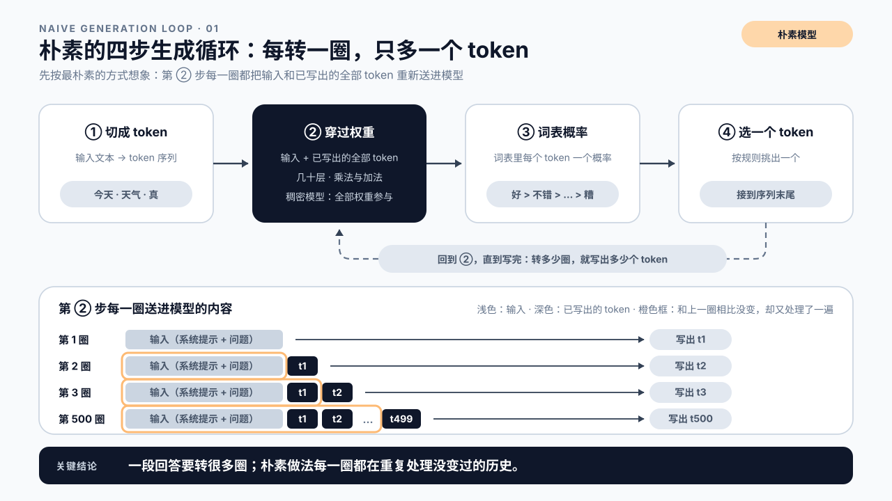
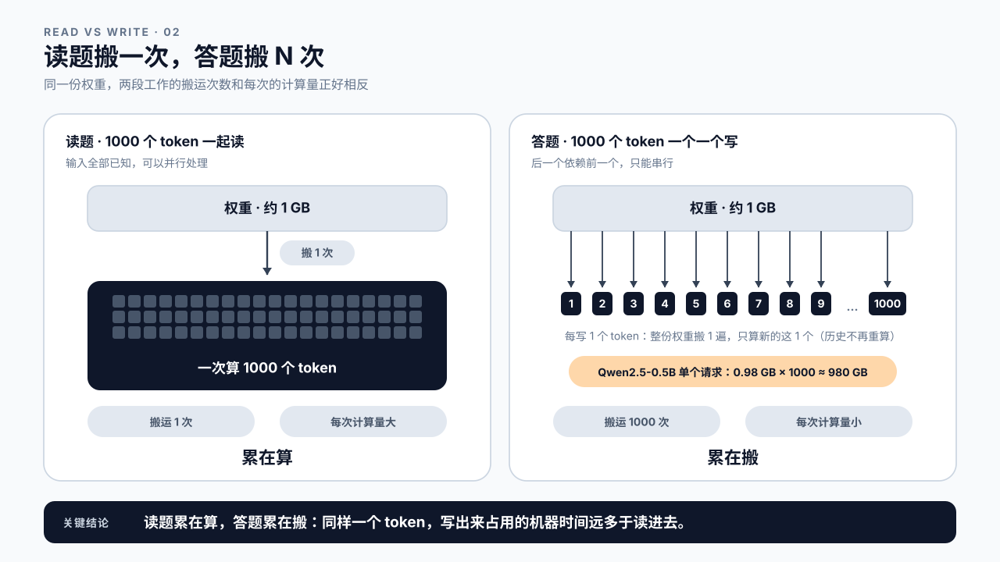
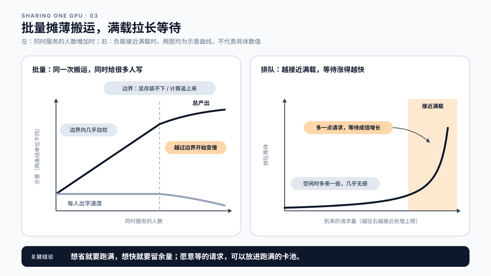

# 第 0 章 推理性能的三条规律：延迟、成本和质量为什么总在互相拉扯

## 学习目标

读完这一章，你应该能回答三个问题：

1. 为什么模型写一个 token，比读一个 token 贵得多？
2. 一张卡同时服务很多人时，为什么越想把卡用满，等待就越难控制？
3. 一次“优化”要满足什么条件，才算真的收益？

这一章不启动服务，也不写代码。读完你会得到三条贯穿全书的规律，和几行能手算的式子。

## 0.1 价目表上有三个说不通的差价

设想你的产品接入大模型刚满一周，调的是 API 还是自己部署的服务都一样，三个人先后来找你。用户说回答出得太慢；财务说这个月的账单超了预算；产品经理说回答质量不能再往下掉，已经有人投诉答非所问。三个人要的分别是快、省、好，也就是延迟、成本和质量，而你很快会发现，这三件事总是按下葫芦浮起瓢。

要弄清楚为什么，先从最容易拿到手的那张账单看起。账单上的计量单位既不是请求数，也不是字数，而是 token。

> **token**：模型读写文本的最小单位，可能是一个字、一个词的一部分或一个标点，切法由模型的词表决定，所以 token 数和字数对不上。
> API 按它计价，性能按它计量，上下文长度按它设限，本书几乎每个数字的分母里都有它。

账单背后发生的事情叫推理：模型训练完成之后，在线上接收请求、生成回答的过程。这本书要优化的就是它，让它更快、更稳、更省，同时不让回答变差。

推理的钱和训练的钱，花法不同。单次训练花完就结束，模型换代时再花一次，但不随用户的调用增长；推理的费用却跟着每一次调用累积。2023 年，Alphabet 董事长约翰·亨尼西（John Hennessy）对路透社估计，和大模型对话一次的成本，大约是一次普通关键词搜索的 10 倍。所以推理上省下的每一个百分点，都会在每一次调用上重复兑现。

把一家主流模型 API 的价目表摊开，会看到三个不太好解释的差价。下面这三行取自 Anthropic 公布的价目表，2026 年 9 月 24 日查询，表内当时列出 18 个模型：

| 价目表上的差价 | 查到的幅度 |
|---|---|
| 输出 token 比输入 token 贵 | 输出单价恰好是输入的 5 倍，18 个模型无一例外 |
| 愿意等的请求更便宜（批处理接口） | 五折 |
| 命中缓存的输入比未命中的便宜 | 多数模型是未命中价格的十分之一，最深的到四十分之一 |

同一张表上还有一条方向相反的价格，它是第三个差价的代价：把内容写进缓存本身要加价，5 分钟有效期的写入是输入单价的 1.25 倍，1 小时的是 2 倍。所以缓存不是无条件便宜，这条代价在 0.3 还会再提一次。

别家的幅度不一样，有的厂商还按时段打折，本章没有逐家核对。价格是商业决定，不是成本的精确换算，数字也会变。但三个差价的方向并不随意，在机器里都有对应的成本结构。自己部署时，账单从按 token 变成按卡时，这些结构不变，只是全落在了你自己的卡上。课后练习第 1 题会让你把自己在用的那家的三个比值查出来，和这三行对照。

换成三个问题来问：同样是一个 token，为什么写出来比读进去贵？为什么肯多等一会儿，就能便宜一半？为什么重复发送的内容便宜得多，而第一次发送反而要加价？要回答它们，得先看清楚模型是怎样写出一段回答的。

## 0.2 模型是一摞参数，回答是一个循环

打开第 1 章要用的 Qwen2.5-0.5B-Instruct 的模型仓库，一个模型由什么组成就摆在眼前：

| 文件 | 装的是什么 | 大小 |
|---|---|---|
| `config.json` | 结构说明：24 层，每层多宽，词表多大 | 不到 1 KB |
| `tokenizer.json`、`vocab.json` 等 | 词表：把文字切成约 15 万种 token 的规则 | 几 MB |
| `model.safetensors` | 权重 | 约 988 MB |

还有一样东西不在仓库里：把这些文件读进来、真正执行计算的程序，第 1 章用的是 vLLM。一个能跑的模型，是结构、权重和执行代码三样凑在一起。权重是其中最大的一块，语法、事实和推理能力都编码在这些数字的取值里，讲性能时先盯住它。

> **参数（权重）**：模型里由训练确定下来的数字。训练调整它们，推理只读取它们，推理过程中它们保持不变。
> 本书行文里“参数”和“权重”指同一样东西。

它为什么是 988 MB，可以亲手算一次。这个模型约有 4.9 亿个参数，按 16 位浮点存储（配置里写的是 bfloat16），每个数占 2 字节：

```text
0.49 × 10⁹ × 2 字节 ≈ 0.98 GB，约 1 GB
```

和仓库里的权重文件对得上。请拿计算器算一遍，这个“约 1 GB”后面会反复用到。过去几年，这摞数字变厚得很快：

| 年份 | 模型 | 总参数 | 每写一个 token 实际用到的参数 |
|---|---|---|---|
| 2018 | GPT-1 | 1.17 亿 | 1.17 亿 |
| 2020 | GPT-3 | 1750 亿 | 1750 亿 |
| 2024 | DeepSeek-V3 | 6710 亿 | 约 370 亿 |

前两行是稠密模型，每写一个 token，所有参数都要参与。第三行是一个 MoE 模型。

> **MoE**（Mixture of Experts，混合专家）：把模型的一部分拆成许多“专家”，每个 token 只交给其中少数几个处理的结构。
> 它让“总参数”和“每一步真正要动的参数”脱钩，但所有专家通常仍要装进显存。细节在附录 D。

对稠密模型，“越大越强”和“越大越贵”是同一件事的两面；MoE 把这两面拆开了一部分。本章后面说“每写一个 token 要把权重搬一遍”时，默认指稠密模型。

这摞数字怎样写出一段回答？先用最朴素的方式想象：

```text
① 把输入切成 token 序列
② 让整段序列（输入 + 已经写出的全部 token）穿过那摞权重：几十层，每层主要是乘法和加法
③ 在末端得到词表里每个 token 的概率
④ 选出一个 token，接到序列末尾，回到 ②
```



图0-1：朴素的四步生成循环。

这个循环每转一圈，只多出一个 token。一段 500 个 token 的回答要转 500 圈，对稠密模型，每一圈那约 1 GB 的权重都要完整参与一遍。用户感受到的“一次回答”，在机器里是几百步。

再看一眼第 ② 步，这个循环有一处明显的浪费：每写一个 token，都要把前面那些一个字没变的内容重新处理一遍。第 300 圈和第 299 圈相比，序列只多了最后一个 token，前面的部分却要从头再算。真实系统怎样绕开它，下一节先说结论，机制在第 3 章。

## 0.3 读题可以一起读，答题只能一个一个写

同样是一个 token，为什么写出来比读进去贵？答案藏在训练和推理的一个不对称里。早些年的循环神经网络只能一个词接一个词地读，2017 年的 Transformer 改变了这一点：训练时整段文本已经在手，每个位置可以同时计算，上一节那张参数表才涨得那么快。

但这份并行有一个前提：文本已经在手。推理时，模型要做两段不同的工作。先读题：用户发来的输入全部已知，可以像训练时一样一次并行读完。再答题：第 n+1 个 token 要等第 n 个写出来，才知道该写什么，只能一个一个来。

**让模型训得大的那种并行，对写新 token 帮不上忙。** 这是推理和训练最根本的不对称。这两段工作在第 2 章有正式的名字，第 3 章讲它们在模型内部为什么是这个样子；第 18 章的先猜后验证能一次多产出几个 token，但同样绕不开“后一个依赖前一个”。

读和写的代价差在哪里，要先知道一件事：权重一直放在显存里，但 GPU 里负责计算的部分和显存是分开的，每用一次，都得把数据从显存读过去，而读的速度有上限。本章把这件事叫“搬”。

另外，上一节朴素循环里的浪费，真实系统已经绕开了：处理过的历史存下来，不再重算，每一圈只为新写的那一个 token 计算。按这种做法比较读和写：

```text
读 1000 个 token 的题   权重搬 1 次，这一次里算很多
写 1000 个 token 的答   权重搬 1000 次，每次只算新的一个 token
```

以 Qwen2.5-0.5B 为例，单独服务一个请求时，写 1000 个 token，光权重就要搬约 980 GB 的数据。计算部分很快，答题时它大部分时间在等数据搬过来。**读题累在算，答题累在搬。**

答题只能一个一个写，每写一个都要把权重搬一遍，所以写比读贵；算过的历史存下来，就不必重算。这是本章的第一条规律。



图0-2：读题搬一次，答题搬 N 次。

第 1 章会跑出一份真实记录，可以先看一眼。那次请求读了 30 个 token、写了 256 个 token：客户端 29.64 ms 就收到第一段正文，读题连同写出第一个 token 都在这段时间里；写完剩下的内容又用了约 2.3 秒，正文平均每 9.15 ms 到一段。读 30 个 token 连同写出第一个 token，加起来也就是写三段多一点的时间（29.64 ÷ 9.15 ≈ 3.2）。这次的题很短，题长了读题也会变慢（第 11 章）；这也只是客户端观测，一段正文不严格等于一个 token，首段里还含着网络（第 5 章讲这些边界）。

第一条规律回答了价目表上的第一个差价：同样是一个 token，写出来占用的机器时间远多于读进去。“每写一个 token 搬一遍权重”这句话，到第 15 章会变成一条式子，算出一张卡上写一个 token 最快要多久。

第一条规律的后半句，回答了价目表上的第三个差价。一段系统提示词如果每次请求都原样发送，服务方把第一次算出的结果留着，后面的请求直接接着用，这部分几乎不再占用计算，命中缓存的输入因此便宜得多。留着这份结果要占显存，所以第一次写入才要加价，而且缓存到期就作废。同一段内容被重复用得够多，省下的计算才补得回那笔加价；这条界线在哪里，第 13 章会算。

开头那位用户说回答出得太慢，这句话至少可能指两件事：迟迟看不到第一个字，或者字出得慢。前一件主要看读题，以及请求在前面等了多久；后一件主要看答题。两件事的修法不同，第 1 章会把这两个数分开测出来，第 5 章给它们正式的名字。

## 0.4 一张卡同时服务很多人：批量摊薄搬运，满载拉长等待

到这里说的都是一个请求，可一张 GPU 很少只服务一个人。

顺着上一节推下去：既然每写一个 token 都要搬一遍权重，那就让同一次搬运同时给几十个人各写一个 token，搬运量几乎没变，产出却翻了几十倍。把多个请求放进同一步一起算，叫批量。在一定范围内，每个人的出字速度几乎不受影响，这在性能工程里很少见，几乎是白捡的。

白捡有边界。每个人读过、写过的内容都要占一份显存，人多了装不下；人再多，计算量也会追上来，再加人就真的变慢。边界在哪里，第 15、16 章会算。

不过，批量并没有抹平读和写的差距。它摊薄的是每个 token 分到的搬运，同一张卡一秒钟能读进的 token，仍然远多于它能写出的 token。价目表上的输出溢价，对应的就是这个差距。

既然批量让卡这么划算，人人都想把卡用满。这里说的满载，是到来的请求量接近这张卡能处理的上限，不是监控面板上的 GPU 利用率。问题出在排队上：越接近满载，新来的请求越可能要等，而且等待不是均匀上涨的。

请求是随机到来的。卡还空的时候，偶尔来一阵密集请求，很快就消化掉了；接近满载时，同样一阵请求会堆出一段队伍，而用来消化它的余量又很小，队伍要很久才散得掉。所以空闲时多来一些请求几乎无感，接近满载时再多一点，等待就可能成倍增长。银行柜台、收费站都是这样；到底涨得多快，第 20 章给出一张表。

排队也不公平：同一时刻到来的请求，有的刚好赶上空档，有的排在队尾。所以接近满载时，最先变差的是最慢的那部分请求，平均值往往还看不出来；怎样把这部分单独看，第 5 章讲。



图0-3：批量摊薄搬运，满载拉长等待。

**快和省在这里第一次撞上。** 想省，就要把卡跑满；想让每个人少等，就要留出余量。批量能摊薄搬运，但越接近满载，等待涨得越快，这是本章的第二条规律。

愿意等的请求恰好化解了这个冲突。批量处理文档、夜里生成报表，晚几个小时拿到结果都没关系，平台可以把它们攒成大批、塞进空闲时段，把卡跑满也不怕谁等得不耐烦。这就是第二个差价的来历。自己的服务也一样：实时对话要为等待留余量，离线任务应该尽量跑满，两者最好不共用一套配置。

## 0.5 什么才算优化：只有有用的产出才算数

把卡用满、让吞吐涨上去，就算优化成功了吗？不一定，这只说明机器在忙。超时的、失败重来的、质量不过关的回答，同样占着卡，却没有交付任何东西。只有成功、质量达标、而且在用户能接受的时间内送到的产出，才算有用。第 5 章会把这些条件写成可以检查的定义；GPU 利用率为什么常常显示得比实际更忙，第 15 章解释。

按这个标准算账，就得到本章唯一的成本式子：

```text
单位成本 = 资源成本 ÷ 有用的产出
```

有用的产出可以按请求算，也可以按 token 算，第 5 章讲怎么选。吞吐、成功率和质量都在分母里，所以性能工作天然就是成本工作；只盯着把卡跑满、不看分母，账会越算越好看，实际越来越亏。满载成本和实际成本为什么会差出几倍，第 26 章会算；要不要自己部署，是第 22 章的问题。

“有用”首先要求够好。快和省常常是拿“好”换来的：换更小的模型、降低数值精度、让回答更短，代价都可能落在回答质量上；0.7 的案例二是反方向的一例，回答写得更充分，账单就翻了一倍。所以质量是否决项，不是加分项。这类优化可以用，但要先有固定的质量检查和一条事先定好的底线，越过底线的提速都不算收益；底线为什么必须事先定，第 17 章讲。

“有用”也要求够快，但快本身不是目标。首字等待从 20 秒降到 1 秒，体验天差地别；从 0.1 秒降到 0.01 秒，人几乎感觉不到。越过某个点，再省下的时间不如拿去换别的：让同一张卡服务更多人，或者在同样的等待下换一个更大、回答更好的模型。性能余量是一种可以兑换的预算。

**只有有用的产出才算数，这是本章的第三条规律。** 由此可以说清本书说的性能：它是快、省、好三者之间的一个位置。快是延迟，省是每份有用的产出花掉多少资源，好是回答质量。三者咬在一起，“有用”本身就要求够快、够好，没法只推其中一个。开头那三个人，用户要的快、财务要的省、产品经理要的好，拉的是同一个位置的三个方向。优化，就是在证据支持下移动这个位置。

这个位置能挪动的空间，往往比想象的大，而且很多时候不用换卡。vLLM 的论文报告，在延迟保持同一水平时，只是改进服务软件管理显存和安排请求的方式，吞吐就比当时的主流系统高出 2 到 4 倍。同样的卡、同样的模型，差出来的这几倍，就是本书要教你找出来、再换成快、省或好的东西。

## 0.6 怎样证明：规律只给假设，结论要靠测量

本章讲了三条规律。一，答题只能一个一个写，每写一个都要把权重搬一遍，所以写比读贵；算过的历史存下来，就不必重算。二，批量能摊薄搬运，但越接近满载，等待涨得越快。三，只有有用的产出才算数。

它们都有适用范围。拿第一条来说：上下文很长、同时服务的人又很多时，每个人读过、写过的内容也要跟着搬，加起来可能比权重还大，要搬的东西就换了主角。所以规律只能告诉你先怀疑哪里，不能直接给出结论。用户一句“慢”，要先变成能调查的问题：慢在哪一段、和什么比、改完拿什么判断；“改完感觉快了”不算结论。

把这些合起来，就是本书说的 **LLM 推理性能工程**：面向已经训练好的大模型在线服务的一套工作方法。先说清楚要服务什么样的请求、什么样的结果算合格，再用可复现的测量找到最慢或最花钱的那一段，改动之后在同样的条件下验证，最后把收益守住。它要的不是某一个数字变好看，而是在质量底线之内，让有用的产出来得更快、花得更少。怎样让测量可复现，第 7 章讲；怎样把怀疑写成能被推翻的假设，第 10 章讲。

全书的主线是这套方法的顺序：

```text
运行 → 测量 → 诊断 → 优化 → 验证 → 上线守护
```

三条规律用在其中两步：诊断时决定先怀疑哪里，验证时决定拿什么判断输赢。往后每一篇开头都会告诉你走到了主线的哪一步，以及那一篇的道理是这三条规律里哪一条的定量版本。第 1 篇从第一步开始。

## 0.7 课堂案例与常见误区

### 案例一：输入砍掉一半，回答还是一样慢

合成设定：一个客服助手平均每次输入 2000 个 token，回答 400 个 token。用户嫌慢，团队把检索回来的资料砍掉一半，输入降到 1000 个 token。上线后，用户觉得第一个字出来得快了一点，整段回答的等待却几乎没变。

输入减半，省下的只是读题那一段；400 个 token 的回答还是要一个一个写，写的循环一圈都没少。按第一条规律，读题本来就是整段等待里便宜的那部分。

讨论：如果目标是让用户更早看到第一个字，砍输入有没有用？如果目标是整段回答更快结束，该先动哪里？

### 案例二：让模型先解释再作答，账单翻倍

合成设定：一个接口平均每次输入 1000 个 token、输出 100 个 token，输出单价是输入的 5 倍。产品要求模型“先解释思路，再给答案”，平均输出涨到 400 个 token。把输入单价记为 1：

```text
改前  1000 × 1 + 100 × 5 = 1500
改后  1000 × 1 + 400 × 5 = 3000
```

账单翻倍。输入一个字没变，涨的全是答题那一半；写答案的循环从 100 圈变成 400 圈，这一段时间也约变成原来的四倍。

讨论：如果解释让回答质量明显变好，这笔钱花得值吗？该拿什么证据来判断？

### 案例三：每张卡承接的请求从能力的四成加到九成，账单降了，投诉涨了

合成设定：为了降成本，一个团队把请求集中到更少的卡上，每张卡承接的请求量从它能处理上限的四成左右升到九成左右。月账单确实降了，“等太久”的投诉却明显多了起来。

接近满载时，等待会成倍增长。一部分用户等不及就放弃了，这些请求占了卡，却没有交付任何东西。分母里有用的产出变少，单位成本并没有账面上降得那么多。

讨论：哪类请求适合放进这种接近满载的卡池里？

### 两个不会写在价目表上的误区

误区一：用的是 API，性能是平台的事。

平台替你管卡，账单和等待却有一大半由调用方决定：输入写多长、让模型写多长、一个任务调几次、重复的内容能不能复用。案例一、案例二里的变化，全都发生在调用方。

误区二：硬件越来越快、价格越来越低，性能问题会自己消失。

省下来的往往很快被新用法吃掉。推理型模型会先“思考”再作答，这部分内容你未必看得到，却按输出 token 计费；Agent 完成一个任务要调几十次模型（第 24 章）。写得越多，第一条规律就越要紧。

## 本章总结

回到开头的三个问题。

**为什么写一个 token 比读一个 token 贵得多？** 读题时输入全部已知，可以一起算，权重只搬一次；答题时后一个依赖前一个，只能一个一个写，稠密模型每写一个都要把整份权重搬一遍。批量能把搬运摊给很多人，但一张卡每秒能读进的 token 仍远多于能写出的，所以输出更贵。算过的历史存下来就不必重算，重复的输入因此便宜。

**为什么越想把卡用满，等待越难控制？** 批量在边界之内几乎不拖慢每个人，所以把卡用满很划算。但请求随机到来，越接近满载，一阵密集请求堆出的队伍越难消化，等待涨得越快，最慢的那部分请求最先变差。想省就要跑满，想快就要留余量；愿意等的请求能化解这个冲突，所以批处理接口能打折。

**一次优化要满足什么，才算收益？** 要让分母里有用的产出变多：成功、质量不越过底线、在用户能接受的时间内送到。利用率和吞吐只说明机器在忙，越过质量底线换来的快也不算数。性能是快、省、好三者之间的一个位置；规律只告诉你先怀疑哪里，收益要在同样条件下改前改后测出来。

规律讲到这里。下一章启动一个真实服务，发出第一次请求；到那一章后半，你会亲眼看到回答是一段一段到达的。

### 本章 Checklist

- [ ] 能说出本章的三条规律，并各举一个现象作证据（价目表、第 1 章的记录或本章案例都可以）。
- [ ] 能算出一个稠密模型每写一个 token 要读的权重字节数，并说出 MoE 模型为什么要分“每步用到的”和“需要装下的”两个数。
- [ ] 能画出“读题搬一次、答题搬 N 次”的对比图，并解释批量为什么没有抹平输出溢价。
- [ ] 拿到一句“回答太慢”，能说出它可能指的两件事，以及各自先怀疑读题还是答题。
- [ ] 能区分“接近满载”和“GPU 利用率高”，并说明接近满载时等待为什么会成倍增长、最先变差的为什么是最慢的那部分请求。
- [ ] 拿到“吞吐提升 40%”这类结论，能列出还缺哪几项证据才算收益。
- [ ] 能解释为什么命中缓存的输入便宜得多，第一次写入却要加价，以及这笔加价什么时候补不回来。
- [ ] 能说出本书主线的六步，并指出三条规律用在其中哪两步。

## 课后练习

1. 打开你在用的一家模型 API 的价目表，记下四个比值：输出单价 ÷ 输入单价、批处理价格 ÷ 标准价格、缓存命中的输入单价 ÷ 未命中的输入单价、缓存写入单价 ÷ 输入单价。交付：四个比值、查询日期、模型名，以及每个比值对应本章哪一条规律的一句话解释。如果这家有 0.1 表里没有的打折方式，也记下来。
2. 统一按每参数 2 字节，计算 Qwen2.5-0.5B（0.49B）、一个 7B 稠密模型、DeepSeek-V3（总参数 671B，每个 token 激活 37B）三者的两个数：每写一个 token 要读的权重，以及显存需要装下的权重。交付：一张三行两列的表和算式。每参数 2 字节只为统一口径，不代表模型实际发布的精度。
3. 一份周报写着：“开启某配置后，吞吐提升 40%，GPU 利用率从 60% 升到 90%。”在认可这是收益之前，写出你要追问的问题。交付：至少三个问题，分别对应等待时间（尤其是最慢的那部分请求）、有用产出的口径、质量底线；再用一句话说明为什么 GPU 利用率不能直接当作负载。
4. 接着上一题的价目表：一段系统提示词每次请求都原样发送，命中缓存的输入价是未命中的十分之一，写入价是输入价的 1.25 倍。设命中率为 h，没命中的那部分要重新写一次缓存，写出“开缓存时每次请求的平均输入单价”这个式子，再解出 h 要超过多少，开缓存才不亏。交付：式子、那个百分比，以及一句话说明为什么缓存的收益取决于命中率而不是取决于用了几次。
5. 用 0.7 案例一的设定（输入 2000、输出 400）做两次对照：只把输入砍到 1000，和只把输出压到 200。分别说明哪一段时间会变短、哪一段不变，以及按第一条规律，哪一次的收益更大。交付：两行对照和一句结论，不要求给毫秒数。
6. 把本章的三条规律各写成一句“所以我应该先怀疑什么”。交付：三句话，每句不超过二十字。这三句后面每一篇开头都会被再用一次。
7. 找一次你自己经历过或听说过的“优化”，按 0.5 那条成本式子检查它：分子（资源成本）变了多少，分母（有用的产出）变了多少，两者是不是用同一段时间、同一批请求算出来的。交付：一段不超过三百字的复盘，明确写出哪一项当时没有测。
8. 本章反复说“规律只给假设，结论要靠测量”。请为第一条规律写出一个能推翻它的观测：什么样的测量结果一旦出现，就说明这次的瓶颈不在搬权重。交付：一条可观测的现象，以及它对应本章哪一句适用范围。
