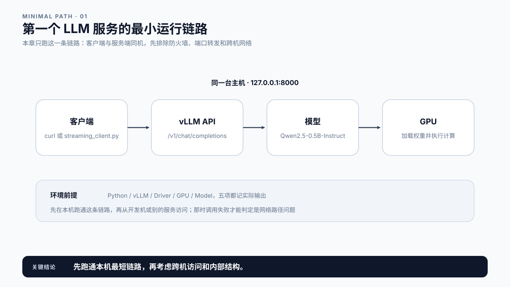
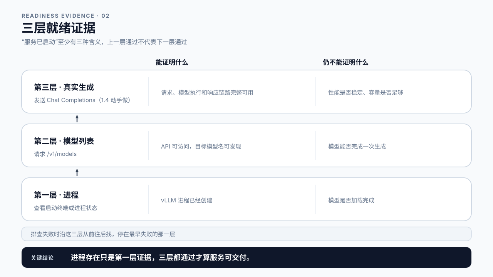
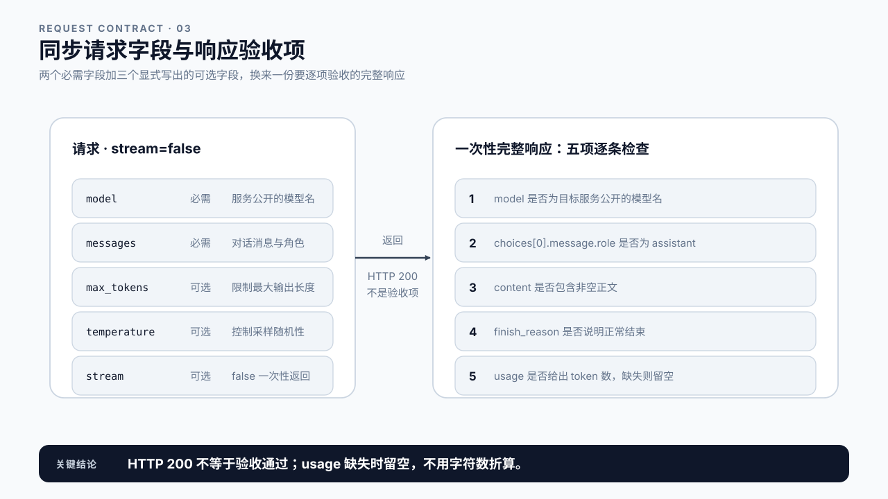
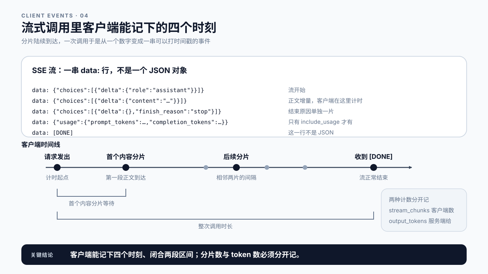
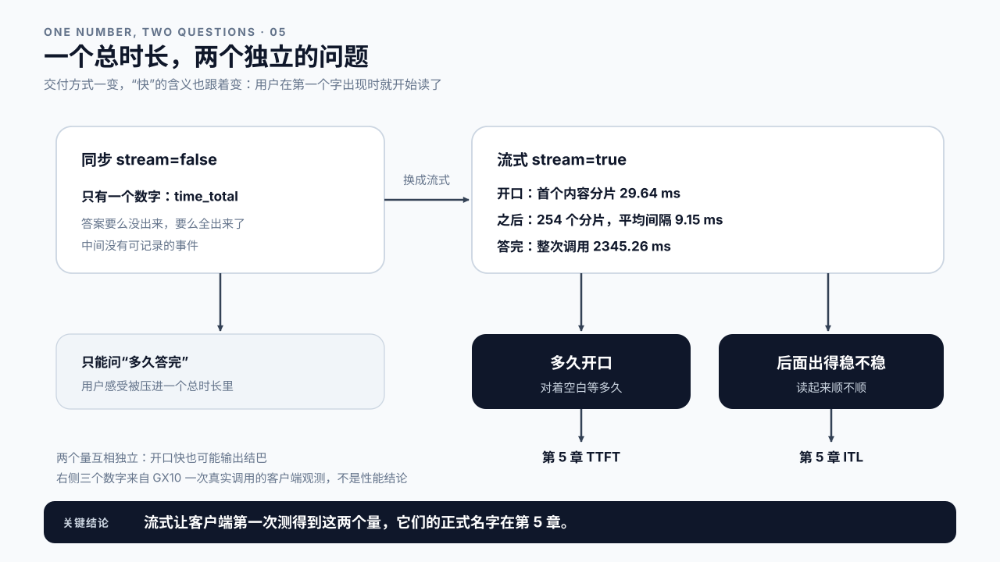

# 第 1 章 第一个 LLM 服务

## 学习目标

读完这一章，你应该能回答三个问题：

1. 怎样确认服务真的完成了一次生成？调用失败时又怎样判断卡在哪一层？
2. 完成第一次调用，最少需要哪些请求参数和验收证据？
3. 同步调用看不到什么？流式能补上其中哪些，又补不上哪些？

跟着做完，你会得到一个能接受请求的 vLLM 服务，以及同步和流式两份客户端运行记录。

## 1.1 准备运行环境

准备一台安装了 NVIDIA GPU 的 Linux 主机，并在这台机器上运行 vLLM。客户端也先放在同一台机器上，通过 `127.0.0.1:8000` 访问服务：

```text
客户端 -> vLLM API -> 模型 -> GPU
```

先跑通本机链路，可以排除防火墙、端口转发和跨机网络问题。等本机验证通过后，再从开发机或其他业务服务访问它；那时如果调用失败，就能确定问题出在网络路径上，而不是服务本身。

启动前确认 Python、vLLM 和 NVIDIA 驱动可用：

```bash
python3 --version
vllm --version
nvidia-smi
```

同时记录实际输出。版本、驱动、GPU 和模型共同构成这次运行的环境，不能只写“使用 vLLM”。

示例使用以下模型：

```text
Qwen/Qwen2.5-0.5B-Instruct
```

这个模型体积较小，并且支持 Chat Completions。如果当前环境已经缓存了其他 instruct 模型，可以替换模型路径，但客户端请求中的 `model` 必须与服务公开的模型名一致。

启动前还要检查：

- 模型目录或模型缓存对当前用户可读；
- GPU 有足够的可用显存；
- 8000 端口没有被其他进程占用。

显存这一项最容易踩坑。vLLM 启动时会按比例预先占下大部分显存，默认约九成，留给模型权重和后面要用的缓存。如果这张 GPU 上还跑着别的进程，第一次启动很可能因为显存不足而退出；这时可以给 `start_vllm.py` 加上 `--gpu-memory-utilization`，把这个比例调低。

当前验收只检查模型能否成功加载，不需要计算显存预算，也不需要调整吞吐或并发参数。



图1-1：客户端、vLLM API、模型和 GPU 先在同一台主机上跑通。

## 1.2 启动 vLLM 服务

在项目根目录运行：

```bash
python3 code/ch01/start_vllm.py \
  --model Qwen/Qwen2.5-0.5B-Instruct \
  --served-model-name Qwen/Qwen2.5-0.5B-Instruct \
  --host 0.0.0.0 \
  --port 8000
```

`--model` 指向模型来源，可以是模型仓库名称，也可以是本地路径。`--served-model-name` 是服务对客户端公开的名字。两者可以相同，也可以不同；客户端只需要使用后者。

`--host 0.0.0.0` 表示监听所有网络接口，`--port 8000` 指定服务端口。如果只允许本机访问，可以把 host 设置为 `127.0.0.1`。

启动后，终端会持续输出模型加载、显存分配和服务初始化日志。看到进程仍在运行，只能证明启动动作已经发生。模型可能仍在加载，API 也可能尚未接受请求。

服务起来之后暴露的是一组 OpenAI-compatible 接口，也就是下一节要用的 `/v1/models` 和 `/v1/chat/completions`。

> **OpenAI-compatible API**：按 OpenAI 的接口约定实现的服务端，路径、请求字段和响应结构都和它保持一致。
> 好处是现成的客户端和 SDK 改个 base URL 就能接上；代价是接口一致不代表行为一致，不同引擎的调度、限流和默认参数差别很大，性能更没有可比性。

## 1.3 如何确认服务已经就绪

“服务已启动”至少有三种不同含义：

| 检查层级 | 如何检查 | 能证明什么 | 仍不能证明什么 |
|---|---|---|---|
| 进程 | 查看启动终端或进程状态 | vLLM 进程已经创建 | 模型是否加载完成 |
| 模型列表 | 请求 `/v1/models` | API 可访问，目标模型名可发现 | 模型能否完成一次生成 |
| 真实生成 | 发送 Chat Completions 请求 | 请求、模型执行和响应链路完整可用 | 性能是否稳定、容量是否足够 |

前两层现在就可以检查，第三层就是下一节要发出的第一次请求。

### 检查进程

先观察启动终端。进程不应立即退出，日志中也不应出现模型路径错误、显存不足或端口占用等致命错误。

### 检查模型列表

进程保持运行后，在另一个终端执行：

```bash
curl -sS http://127.0.0.1:8000/v1/models
```

响应中应该出现：

```text
Qwen/Qwen2.5-0.5B-Instruct
```

响应中包含目标模型名，表示 HTTP API 和模型发现已经通过检查。若请求失败，核对 host、port、模型加载状态和网络路径。模型名能够返回，也还不能说明模型能生成，这要靠第三层来证明：只有一次真实请求返回了非空正文和结束原因，服务才算完成了从 API 到模型生成再到响应返回的最小闭环。



图1-2：三层证据自下而上，上一层通过不代表下一层通过。

## 1.4 发出第一次同步请求

保持 vLLM 服务运行，在第二个终端执行：

```bash
curl -sS http://127.0.0.1:8000/v1/chat/completions \
  -H 'Content-Type: application/json' \
  -w '\nHTTP %{http_code}  total %{time_total}s\n' \
  -d '{
    "model": "Qwen/Qwen2.5-0.5B-Instruct",
    "messages": [
      {"role": "user", "content": "请用三句话介绍 LLM 在线推理。"}
    ],
    "max_tokens": 160,
    "temperature": 0,
    "stream": false
  }'
```

这是一条最小的同步 Chat Completions 请求：

| 字段 | 是否必需 | 作用 | 示例设置 |
|---|---|---|---|
| `model` | 必需 | 指定服务公开的模型名 | 与 `served-model-name` 一致 |
| `messages` | 必需 | 提供对话消息及角色 | 一条 user 消息 |
| `max_tokens` | 可选 | 限制最大输出长度 | 显式设为 160，避免输出失控 |
| `temperature` | 可选 | 控制采样随机性 | 显式设为 0，减少随机变化 |
| `stream` | 可选 | 决定是否分段返回 | 显式设为 `false`，等待完整响应 |

最小 Chat Completions 请求只需要 `model` 和 `messages`。示例显式写出另外三个可选参数：`max_tokens` 限制输出长度，`temperature=0` 减少随机变化，`stream=false` 要求服务生成完成后一次性返回 JSON。

命令里的 `-w` 不属于请求本身，它让 curl 在响应正文之后再打印两项：HTTP 状态码，以及从发出请求到收完响应的总耗时。下一节先看状态码，1.9 节再回来看这个总耗时。

## 1.5 检查完整响应

命令执行完，终端打印出一段 JSON，最后一行是 `HTTP 200`。这次调用成功了吗？

还不能下结论。HTTP 200 只说明服务收下了请求并返回了一个响应，它不保证响应里真的有模型生成的内容。模型一开始就生成了结束符、生成被很小的长度上限立刻截断、或者加载的模型并不适合对话，都可能得到一个结构完整、状态码正常、正文却是空的 200。

所以看到状态码不能收工，要打开响应逐项确认。典型响应包含以下结构：

```json
{
  "model": "Qwen/Qwen2.5-0.5B-Instruct",
  "choices": [
    {
      "message": {
        "role": "assistant",
        "content": "..."
      },
      "finish_reason": "stop"
    }
  ],
  "usage": {
    "prompt_tokens": null,
    "completion_tokens": null,
    "total_tokens": null
  }
}
```

这里的 `null` 只表示字段位置，不是实验结果。实际 token 数必须从真实响应中读取；1.8 节会给出一份在真实 GPU 上跑出来的记录。

验收时依次检查：

1. `model` 是否是目标服务公开的模型名；
2. `choices[0].message.role` 是否为 `assistant`；
3. `choices[0].message.content` 是否包含非空正文；
4. `choices[0].finish_reason` 是否说明请求正常结束；
5. `usage` 是否提供输入、输出和总 token 数。

`finish_reason=stop` 通常表示模型遇到停止条件并正常结束；`finish_reason=length` 表示输出达到了长度上限。两者都说明请求已经结束，但含义不同：前者得到自然结束的回答，后者可能截断内容。

如果 `usage` 缺失，仍然可以根据正文和结束原因确认生成链路可用，但不能填写 token 数。字符数、单词数和 token 数不是同一种计数。

验收记录可以写“同步生成链路可用”，不能写“性能达标”，也不能把一次请求的完整耗时归因到某个服务端阶段。



图1-3：五项验收逐条检查，HTTP 200 不在其中。

## 1.6 保存第一次运行记录

调用成功之后，这次结果要留下来，它是你手上第一份真实的服务运行证据。给 1.4 的命令加上 `-o`，请求体不变：

```bash
  -o ch01-response.json \
  -w 'HTTP %{http_code}  total %{time_total}s\n'
```

`-o` 把响应正文写入文件，`-w` 仍然在终端单独打印状态码和总耗时。两者分开的原因是：状态码和响应正文回答的是不同问题，混在一起会让“连接成功”和“生成成功”看起来像同一件事。

第一次运行记录至少包含：

```text
环境：Python / vLLM / Driver / GPU / Model
服务：base_url / served_model_name / startup command
请求：messages / max_tokens / temperature / stream=false
响应：http_status / model / content / finish_reason / usage
耗时：time_total（客户端测得的整次调用时长）
结论：同步生成链路是否完整跑通
```

运行命令后，用真实响应填写这份记录。还没有连接真实服务时，只保留命令、验收字段和空白模板，不要先填一个示例数字占位，也不要把别处的结果搬过来。这份记录之所以有用，正是因为它只装真实发生过的事。

## 1.7 发出第一次流式请求

把 1.4 的请求换长一些再跑一次，比如让模型分三段介绍。终端会安静好几秒，然后整段答案一次性蹦出来。

放到真实产品里，这几秒的空白就是麻烦。用户盯着不动的界面，不知道系统是在想、卡住了还是已经挂了。让人等一会儿其实还好，难受的是等的时候什么反馈都没有。如果哪天这几秒变成了十几秒，你手上的记录也只有一个 `time_total`，看不出是一直没开始写，还是写得慢。

流式响应就是冲着这件事来的。服务不再攒完再发，而是生成一点发一点。用户看到第一个字就能开始读，后面的内容边生成边补上。总时长可能一秒都没少，但体验完全是两回事。

把 `stream` 改成 `true`：

```bash
curl -N -sS http://127.0.0.1:8000/v1/chat/completions \
  -H 'Content-Type: application/json' \
  -d '{
    "model": "Qwen/Qwen2.5-0.5B-Instruct",
    "messages": [
      {"role": "user", "content": "请分三段介绍 LLM 在线推理的关键环节。"}
    ],
    "max_tokens": 256,
    "temperature": 0,
    "stream": true,
    "stream_options": {"include_usage": true}
  }'
```

和同步请求有两处不同。`stream_options.include_usage` 要求服务在流的末尾额外补一个带 usage 的分片，流式响应默认不返回 token 计数，不加这个参数就拿不到。`-N` 关闭 curl 自己的输出缓冲：直接打印到终端时，加不加都能看到内容一段段出现；一旦把输出接到管道或写进文件，curl 就会先攒在缓冲区里，最后一起吐出来，流式看起来就像没有生效。

### 流式响应的结构

响应不再是一个 JSON 对象，而是一串 Server-Sent Events：

> **SSE**（Server-Sent Events）：一种基于 HTTP 的单向推送格式，服务端在同一个连接上持续写入以 `data: ` 开头的文本行，客户端边收边处理。
> 它比 WebSocket 简单，只支持服务端向客户端推送，这对生成式接口刚好够用，因为请求发出后客户端不需要再说什么。

```text
data: {"id":"...","choices":[{"delta":{"role":"assistant"}}]}
data: {"id":"...","choices":[{"delta":{"content":"LLM"}}]}
data: {"id":"...","choices":[{"delta":{"content":" 在线推理"}}]}
...
data: {"id":"...","choices":[{"delta":{},"finish_reason":"stop"}]}
data: {"id":"...","usage":{"prompt_tokens":0,"completion_tokens":0}}
data: [DONE]
```

每行以 `data: ` 开头，后面跟一个 JSON 分片（chunk）。本书后面说“分片”，指的都是这样一条 `data:` 事件。几处和同步响应的差别值得记住：

- 正文增量在 `choices[0].delta.content`，不再是 `message.content`；
- `finish_reason` 出现在靠近末尾的某个分片上，而不是和正文同一个对象里；
- `usage` 单独占一个分片，且只有开启 `include_usage` 才会出现；
- 整个流以 `data: [DONE]` 结束，这一行不是 JSON。

上面 usage 里的 `0` 只是占位，实际数值要从真实响应读取。

### curl 看得见分片，却记不下时刻

用 curl 能亲眼看到分片陆续到达，但它不会告诉你每个分片是什么时候到的。要把这个过程变成记录，需要一个边收边打时间戳的客户端。`code/ch01/streaming_client.py` 做的就是这件事，从仓库根目录运行：

```bash
python3 code/ch01/streaming_client.py \
  --base-url http://127.0.0.1:8000/v1 \
  --model Qwen/Qwen2.5-0.5B-Instruct \
  --prompt "请用三句话介绍 LLM 在线推理。" \
  --max-tokens 256 \
  --output ch01-streaming-report.json
```

脚本用单调时钟计时（只记经过了多久，不受系统时间调整影响），在同一次调用上记下四类时刻：

| 时刻 | 脚本怎样记录 | 报告字段 |
|---|---|---|
| 请求发出 | 发送请求前取一次时间 | 计时起点 |
| 首个内容分片到达 | 第一个带非空 `content` 的分片 | `time_to_first_content_chunk_ms` |
| 后续每个内容分片到达 | 相邻两个内容分片的到达间隔 | `chunk_interval_avg_ms`、`chunk_interval_p50_ms`、`chunk_interval_p95_ms` |
| 收到 `[DONE]` | 流正常结束 | `total_latency_ms` |

它还会记下客户端数到的内容分片数 `stream_chunks`，以及服务端在 usage 分片里返回的 `prompt_tokens` 和 `output_tokens`。没有收到 `[DONE]`、或者一个内容分片都没收到时，脚本按失败处理并返回非零状态。



图1-4：流式让客户端在同一次调用上记下四个时刻，闭合两段区间。

### 流式调用单独留一份记录

流式调用要单独记一份，在同步记录之外补上：

```text
请求：stream=true / include_usage / prompt / max_tokens
时刻：请求发出 / 首个内容分片 / 分片间隔 / [DONE]
计数：stream_chunks（客户端计数）
usage：prompt_tokens / output_tokens（服务端返回）
结论：流式链路是否完整，是否收到 [DONE]
```

`stream_chunks` 和 usage 分两行记：前者是客户端数出来的，后者是服务端返回的。这两个数经常对不上，下一节给出一份真实记录，1.9 说明为什么。

## 1.8 一份在真实 GPU 上跑出来的记录

模板写好了，接下来看一份真填过的。这一节给出的这份报告，后面第 2、3、5 章还会反复回来取数，本书凡是需要“真实数据”的地方，在第 2 章的真机报告采集完成之前，用的都是它。

课程在一台真机上用同样的命令跑过一次，报告保存在 `content/ch01/evidence/gx10-streaming-client-report.json`。

这台机器后面会出现很多次，先说清它的两个名字：报告里 `validation_environment.host` 是 `gx10`，`gpu` 是 `NVIDIA GB10`。前者是主机名，后者是那台机器上的 GPU 型号。本书凡是说“GX10 上那次调用”，指的都是这台主机；凡是填硬件字段，写的是 GB10。两个名字长得像，但不是一回事，也不是笔误。

`results` 里最关键的几个字段是：

```json
{
  "prompt_tokens": 30,
  "output_tokens": 256,
  "stream_chunks": 254,
  "time_to_first_content_chunk_ms": 29.64,
  "chunk_interval_avg_ms": 9.15,
  "total_latency_ms": 2345.26,
  "request_output_rate_tokens_per_second": 109.16
}
```

读法很直接：请求发出后 29.64 ms，客户端收到第一段正文；此后一共到了 254 个内容分片，平均每 9.15 ms 一个；到收到 `[DONE]`，整次调用用了 2345.26 ms。服务端报告这次读了 30 个 token、写了 256 个 token。最后一个字段是输出 token 数除以整次调用时长，里面含着首分片之前的等待，不是模型写字的速度。

这份报告也有两个缺口，要一起记下。`vllm_version` 是空的，别人拿到它不知道该用哪个版本复现；脚本也没有记录 `finish_reason`，看不出这次回答是自然结束还是被长度上限截断。1.11 节会回到第二个缺口。

## 1.9 从“多久答完”到“多久开口”

现在手上有两份记录。同步那份只有一个时间：`time_total`，从发出请求到整段答案收完。流式那份把同一件事拆开了：GX10 上那次调用，29.64 ms 就出现了第一段正文，之后两秒多里分片一个接一个地到，2345.26 ms 才结束。

如果只看总时长，这是一次“2.3 秒的调用”。可用户在第 30 ms 就开始读了，他感受到的并不是 2.3 秒的空白。

交付方式一变，“快”的含义也跟着变了。同步模式下，用户的体验只能用一个量描述：总时长。答案要么没出来，要么全出来了，中间没有状态。流式之后，第一个字出现时用户就开始读，于是原来那一个量裂成了两个问题：多久看到第一个字，以及后面的字出得稳不稳。前者决定用户要对着空白等多久，后者决定读起来是顺畅还是一顿一顿。

这两个量并不是流式凭空造出来的。非流式请求在服务端同样有“第一个 token 生成”的时刻，只是整段答案攒到最后才发，客户端测不到。流式让客户端第一次测得到这两个量，它们就是第 5 章 TTFT（Time To First Token，首 token 时延）和 ITL（Inter-Token Latency，token 间隔）的来源。

由此可以推出一个不太直觉的结论：两次调用总时长完全相同，用户感受可以差得很远。一次 100 ms 就开口、之后平稳输出；另一次沉默整整 3 秒，最后一口气吐完。同步调用看不出这个差别，流式才让它显形。



图1-5：同步只剩一个总时长，流式把它拆成两个可以分别回答的问题。

但这两份记录能说明的也就到这里，还有两条边界要现在就守住。

### 254 个分片，不是 254 个 token

GX10 那份报告里，客户端数到 254 个内容分片，服务端说写了 256 个 token，两个数对不上。服务端可能把多个 token 合并进一个分片，网络栈也可能把多次写入合并。要 token 数就读 usage，不要去数分片。

### 29.64 ms 不是模型产出首 token 的时间

模型产出首 token 之后，服务端还要把它解码成文本、组装成协议对象、写入网络，数据再经过网络到达客户端；在这之前，请求还可能在服务端排过队。29.64 ms 把这些全部包在里面，客户端单独拆不开。

所以这个值要带上作用域来说：它是**客户端观测到的首个内容分片等待**。把它当成模型产出首 token 的时间，或者拿它和别人报出的服务端数字直接比，都不成立。第 5 章会说明 TTFT 其实是一族有作用域的量，客户端这一支就长这样，届时它有一个正式名字。在那之前，本章一律写“客户端首个内容分片等待”，不把客户端观察值归因到某个服务端阶段；第 2 章引入服务端证据，拆开首分片之前服务端经历的几段。

## 1.10 根据失败现象定位检查层级

第一次调用失败时，回到三层就绪检查，找到最早失败的位置：

| 现象 | 优先检查 | 当前结论 |
|---|---|---|
| 服务进程立即退出 | 模型路径、依赖、显存、端口和启动日志 | 启动失败 |
| 进程存在，但 `/v1/models` 无法访问 | host、port、模型加载状态和网络 | API 尚未就绪 |
| 模型列表正常，请求返回模型不存在 | 请求 `model` 与 `served-model-name` | 模型标识不匹配 |
| 请求返回 HTTP 错误 | 响应错误信息与服务端日志 | 生成请求失败 |
| HTTP 200，但正文为空 | messages、模型类型和响应结构 | 未获得有效回答 |
| 正文存在，但 `finish_reason=length` | `max_tokens` 与回答完整性 | 请求结束，但内容可能被截断 |
| 正文正常，但 `usage` 缺失 | 服务版本和响应能力 | 链路可用，token 计数不可得 |
| 输出接到管道或文件后，内容仍然最后一起出现 | curl 是否加了 `-N` | 链路可用，但 curl 的输出缓冲掩盖了分片到达时刻 |
| 流式分片正常，但没有 usage 分片 | 是否设置 `stream_options.include_usage` | 流式链路可用，token 计数不可得 |
| 流式中断，没有收到 `[DONE]` | 服务端日志、超时设置与网络连接 | 响应未正常收口 |

排查时一次只处理最靠前的问题。API 尚未就绪时，不需要调整请求参数；模型名不匹配时，也不需要先分析 GPU。

最后三行专属于流式调用。特别是第一行：把 curl 的输出接给别的命令后看到内容一次性出现，就断定“流式没生效”，是常见误判，实际往往只是 curl 在缓冲。

## 1.11 课堂案例与常见误区

### 案例一：进程在跑，业务方却说模型不存在

一名工程师用 `--model /models/qwen2.5-0.5b --served-model-name course-model` 启动 vLLM，看到进程持续运行，就把服务地址交给了业务方。业务方照着服务器上的目录，把请求里的 `model` 填成 `/models/qwen2.5-0.5b`，收到“模型不存在”的错误。

这台服务只通过了进程检查。工程师没有读取 `/v1/models`，因此没发现对外公开的名字是 `course-model`，而不是本地路径；也没有用真实生成请求完成最终验收。

处理顺序是：

1. 保留当前启动日志，确认进程没有退出；
2. 请求 `/v1/models`，读取服务公开的模型名；
3. 使用这个模型名发送一次同步 Chat Completions 请求；
4. 检查正文、结束原因和 usage。

讨论：如果模型列表能够返回，但同步请求没有正文，服务通过了哪一层检查？为什么不应该要求业务客户端知道服务器上的模型文件路径？

### 案例二：256 个 token，正好等于上限

回到 GX10 那份报告。请求要的是“三句话”，`max_tokens` 设的是 256，报告里的 `output_tokens` 也是 256，正文有 752 个字符。

输出长度恰好等于上限，说明这次回答很可能是被截断的，而不是模型写完三句话自然停下。但报告没有记录 `finish_reason`，这一点确认不了。于是这份报告能证明“流式链路跑通、客户端收到了 256 个 token 的内容”，不能证明“回答是完整的”。

这个缺口还会影响时间数字。如果回答本来要写 400 个 token，被上限截在 256，那么 2345.26 ms 描述的是“写到上限用了多久”，换一个更大的 `max_tokens` 重跑，总时长就会变。

讨论：要让下一次记录能判断回答是否完整，脚本还应该多记哪个字段？把 `max_tokens` 调到 512 重跑后 `total_latency_ms` 变长了，能不能说服务变慢了？

### 两个不会在排障表里出现的误区

误区一：服务没有返回 usage，可以用字符数代替 token 数。

字符和 token 的切分规则不同，一个 token 可能对应一个汉字、一个词根或一个标点。用字符数、单词数折算 token 数，会让后续所有以 token 为分母的指标失去可比性。usage 不可得时应保留为空，而不是估一个数填上。

误区二：一次请求成功，所以服务性能已经达标。

一次请求只验证链路是否可用。它没有并发、没有重复采样、没有测量窗口，因此不提供稳定性、吞吐、尾延迟或容量结论。GX10 那份报告里的 29.64 ms 和 2345.26 ms 是真实的，但它们只描述那一次调用。第 5 章会说明一个数字要成为指标，还需要哪些条件。

## 本章总结

回到开头的三个问题。

**怎样确认服务真的完成了一次生成，失败时又怎样定位？** 靠三层证据：进程存在、模型列表可访问、真实生成请求成功。每一层各自证明一件事，上一层通过不代表下一层通过。出问题时沿这三层从前往后找，停在最早失败的那一层，不要跳着猜。

**最少需要哪些请求参数和验收证据？** 请求只有 `model` 和 `messages` 是必需的。验收要看五项：模型名、assistant 角色、非空正文、结束原因、token usage。HTTP 200 不在其中，它只说明服务收下了请求。usage 拿不到就留空，不要用字符数折算。

**同步看不到什么，流式又补上了什么？** 同步调用只留下一个总时长，中间没有任何可记录的事件。流式把交付方式改成分片陆续到达，客户端于是能在同一次调用上记下请求发出、首个内容分片、分片间隔和 `[DONE]`。GX10 上那次调用，29.64 ms 开口，2345.26 ms 结束，用户感受到的等待远小于总时长。“快”这一个量由此裂成“多久开口”和“后面出得稳不稳”两个问题，它们正是第 5 章 TTFT 和 ITL 的由来。

但流式补不上的那部分同样重要：这些时刻全部来自客户端。首个分片何时到达可以测，模型何时产出首 token 测不到，两者之间隔着排队、计算、解码、组装和网络；分片数也不等于 token 数。下一章引入服务端证据，拆开首分片之前服务端经历的几段。

### 本章 Checklist

- [ ] 环境记录里有 Python、vLLM、驱动、GPU 和模型五项，没有一项写着“默认”。
- [ ] 服务能启动，完整启动命令已经存下来。
- [ ] 用 `/v1/models` 取到了服务公开的模型名，并用它发出了请求。
- [ ] 跑通一次 `stream=false` 调用，五项验收逐条对过，记录里有 `time_total`。
- [ ] 跑通一次 `stream=true` 调用，能指着输出说出哪一行是正文增量、哪一行是 usage、哪一行是结束。
- [ ] 用 `streaming_client.py` 生成了一份报告，能指出首个内容分片等待、分片间隔和总时长分别在哪个字段。
- [ ] 同步和流式两份运行记录都已保存，`stream_chunks` 和 usage 分开记。
- [ ] `usage` 缺失的那次，token 数留了空，没有拿字符数折算。
- [ ] 两份记录里都没有出现“性能”“达标”这类词。

## 课后练习

1. 启动示例模型，通过进程、模型列表和真实生成三层检查。
2. 保存一次同步请求及其完整 JSON 响应，记下 `time_total`，并在响应中标出模型名、assistant 正文、finish reason 和 usage 四项。
3. 故意把请求中的 `model` 改成错误名称，记录响应，再用 `/v1/models` 修正。
4. 把 `max_tokens` 设置得较小，观察 finish reason，并判断回答是否完整。
5. 对同一个 prompt 分别发同步和流式请求，比较两份记录：各自能回答什么问题，各自回答不了什么。
6. 把流式 curl 的输出接给 `cat` 再跑一次，分别在加和不加 `-N` 时观察内容出现的方式；再去掉 `stream_options.include_usage` 重跑一次。分别解释：前一种情况是不是流式没生效，后一种情况还能不能填写 token 数。
7. 运行 `streaming_client.py`，对比报告里的 `stream_chunks` 与 `output_tokens`，解释两者为什么可以不相等。
8. 写一份最小服务验收清单，要求另一位工程师只看清单就能完成同步与流式两次验证。
