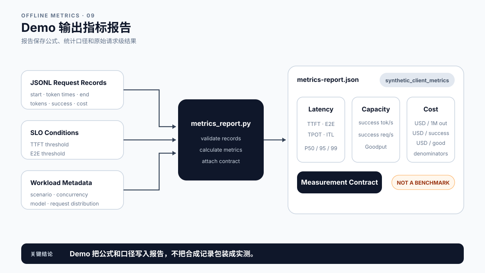

# 第 5 章 性能指标与延迟预算：先统一口径，再比较数字

## 学习目标

读完这一章，你应该能回答三个问题：

1. 说一个服务“慢”或“快”，到底在说哪个量？延迟、吞吐和有效产能各自覆盖什么？
2. 同一个指标名，怎样保证两份报告说的是同一件事？
3. 业务 SLO 怎样拆成各阶段的预算，一份真实报告又能验证其中哪几段？

跟着做完，你会得到一份写全十个字段的指标合同，以及一版从业务 SLO 反推出来的阶段预算。

## 5.1 指标先回答问题

第 2 章定义了请求生命周期，第 3、4 章分别解释模型执行和 Serving 组件。当团队说“慢”“吞吐高”“GPU 很忙”或“成本下降”时，这些话究竟对应哪个观测点、哪个统计窗口和哪个分母？本章把前面几种视图转换成测量语言。怎样设计正式 Benchmark 不在本章：Workload 与 SLO 在第 6 章定义，Warmup、重复次数和实验控制属于第 7 章。

指标不是越多越好。先写问题，再选择数字：

| 问题 | 指标族 | 常见指标 |
|---|---|---|
| 用户多久看到反馈？ | 交互延迟 | TTFT、ITL / TPOT、E2E |
| 系统单位时间完成多少工作？ | 产能 | 成功/已观测 output tokens/s、成功 requests/s |
| 达标的有效工作有多少？ | 可靠产能 | Goodput、成功率、取消率 |
| 慢请求集中在尾部吗？ | 分布 | P50、P95、P99、最大值、样本量 |
| 资源发生了什么？ | 资源状态 | GPU Utilization、显存占用、显存带宽、Queue Depth |
| 每单位有效结果花多少钱？ | 成本 | USD / 1M input tokens、USD / 1M output tokens、USD / good request |

同一次改动可能让成功输出 token 速率上升，却让 TTFT P99 变差；也可能减少显存占用，却增加 GPU 小时。性能报告必须同时覆盖目标和护栏，不能只挑最好看的数字。


图5-1：指标先回答问题。

## 5.2 客户端、服务端与 GPU：先确定测量边界

同一个请求至少有三种时钟：

- 客户端时钟：从调用方发出请求，到收到首个非空内容、后续流式分片和最终结束。
- 服务端时钟：从 Gateway 或 Engine 接收请求，到排队、调度、首 token、最后 token、序列回收。
- GPU 时钟：Kernel 的提交、开始、结束，显存读写和计算单元活动。

客户端 TTFT 包含网络、入口处理、排队、Prefill、Sampling 和首段返回。服务端的 `first_token` 指标可能从 `request_received` 开始，也可能只覆盖 Engine 内部。GPU Kernel Duration 只覆盖设备执行。三个数字可以同时正确，却不应共用一个标签。这就是本篇开头那条观测边界：三个数字各自的作用域由它的起止事件和记录方划定，换一个记录方就是换一个数字。

第 1 章的流式脚本统计的是首个非空内容分片，不保证一个分片只含一个 token。接入真实接口时，如果没有逐 token 时间戳，应写 `time_to_first_content_chunk` 和 `chunk_interval`；不能把分片间隔直接命名为严格 ITL。时钟来源也要固定，单调时钟与跨机时钟对齐的要求见第 2 章 2.3。


图5-2：客户端与服务端测量边界。

## 5.3 一个“慢”字，三种感受，四个量

用户说“这个服务慢”，这句话至少可能指三件不同的事：点了半天没反应；字出来了但一顿一顿；答案完整给出得太晚。三种感受对应三种不同的系统问题，修法也完全不同。第 1.9 节已经看到，两次调用总时长相同，用户感受可以差得很远；只报一个总时长，三种问题会被压进同一个数字里。

所以延迟要拆成几个量来描述：

| 指标 | 回答的问题 | 对应哪种感受 |
|---|---|---|
| TTFT | 多久看到第一个字 | 点了半天没反应 |
| ITL | 相邻两个字之间隔多久 | 一顿一顿 |
| TPOT | 首字之后平均每个字多久 | 一顿一顿 |
| E2E | 多久拿到完整答案 | 答案给得太晚 |

ITL 和 TPOT 描述的是同一种感受，只是看法不同：ITL 逐个记录每一次间隔，TPOT 把首字之后的间隔平均成一个数。这几个量各自独立变化。TTFT 好而 ITL 差，是“开口快但说话结巴”；反过来则是“半天不开口，一开口就说完”。把它们混成一个平均值，任何一种问题都定位不了。

> **TPOT**（Time Per Output Token，每输出 token 耗时）：首个 token 之后，平均每生成一个输出 token 花的时间。
> 它和 ITL（Inter-Token Latency，token 间隔）指向同一件事，区别是 TPOT 是整条请求的一个平均值，ITL 是逐个间隔的序列，能看出抖动。第 15 章算 Decode 的单步下限时，用的就是 TPOT。

先固定客户端的时间坐标。为了不和第 2 章服务端的 `t0` 到 `t5` 混淆，这里用 `c` 表示客户端时刻：请求在 `c_send` 发出，第一个输出 token 在 `c_1` 被观察到，第 i 个在 `c_i`，最后一个在 `c_n`，响应在 `c_end` 确认完成。

```text
TTFT   = c_1 - c_send
E2E    = c_end - c_send
ITL_i  = c_i - c_(i-1),          i = 2 ... n
TPOT   = (c_n - c_1) / (n - 1),  n > 1
```

TTFT 描述用户等待首次有效反馈的时间。它是端到端结果指标，不等同于 Prefill；Queue、网络和入口处理都可能在其中。

E2E 同时受首 token 前等待、输出长度、生成节奏和响应尾部影响。比较 E2E 时必须同时报告输入与输出 token 分布，否则回答变短也会被读成“变快了”。

ITL 是一组值，可以计算均值与分位数，它直接呈现流式输出是否均匀。本书的客户端 Demo 用上面的公式算 TPOT，它等于第 2 个到第 n 个 ITL 的平均值。只有一个输出 token 时，TPOT 未定义，报告为 `null`，而不是 0。其他工具可能用 `(E2E - TTFT) / (output_tokens - 1)`；如果 `c_end` 还包含尾部网络或清理时间，两种结果会有差异，所以报告中必须写公式。

拿一条请求实际算一遍。它输出 5 个 token，客户端记下的时刻是（单位 ms）：

```text
c_send = 0
c_1..c_5 = 180, 220, 260, 700, 740
c_end = 760
```

| 指标 | 算式 | 结果 |
|---|---|---:|
| TTFT | 180 − 0 | 180 ms |
| ITL | 220 − 180, 260 − 220, 700 − 260, 740 − 700 | 40, 40, 440, 40 ms |
| TPOT | (740 − 180) / 4 | 140 ms |
| E2E | 760 − 0 | 760 ms |

只看 TPOT，140 ms 像是“整体偏慢”。看 ITL 才知道，四次间隔里三次只有 40 ms，真正的问题是中间停了一次 440 ms。只报平均值，会把一次明显的卡顿摊成一个看起来温和的数字。


图5-3：TTFT、TPOT 与 ITL。

## 5.4 吞吐率与 Goodput：先把分子和窗口写全

“TPS”这个缩写很容易制造误解。它可能指 Input Tokens/s、Output Tokens/s，也可能把两者相加。本书要求把方向写进名称。

下面用 `code/ch05/sample.jsonl` 里的四条合成请求演示几种算法。它们只用来核对公式，不代表任何真实服务：

| 请求 | 开始 | 结束 | 输出 token | 成功 | 质量达标 | TTFT |
|---|---:|---:|---:|---|---|---:|
| req-001 | 0 ms | 280 ms | 4 | 是 | 是 | 120 ms |
| req-002 | 40 ms | 360 ms | 3 | 是 | 是 | 190 ms |
| req-003 | 90 ms | 510 ms | 2 | 是 | 否 | 300 ms |
| req-004 | 150 ms | 430 ms | 0 | 否 | 否 | 无 |

### 成功输出 token 速率

对并发请求，系统吞吐使用共享测量窗口：

```text
successful_output_tokens_per_second
  = window 内成功生成的 output tokens
    / (最后结束时间 - 最早开始时间)
```

样例的窗口从 0 ms 到 510 ms，共 0.51 s，三条成功请求输出了 9 个 token，成功输出 token 速率是 9 / 0.51 ≈ 17.6 tokens/s。

常见的错误算法是先算每条请求自己的速度再相加：4 / 0.28 + 3 / 0.32 + 2 / 0.42 ≈ 14.3 + 9.4 + 4.8 = 28.4 tokens/s，比正确结果高出六成。三条请求在时间上是重叠的，同一段墙钟时间被每条请求各算了一遍。

### 成功请求速率

```text
successful_requests_per_second
  = window 内成功请求数 / measurement_window
```

样例里是 3 / 0.51 ≈ 5.88 req/s。成功请求速率与成功输出 token 速率不会固定同比变化。短回答可能带来更高的请求速率和更低的 token 速率；长回答可能相反。两者都要带上 workload。

`submitted_requests_per_second_over_run_window` 使用“最早提交到最晚完成”的整场运行窗口。它描述本次运行的提交负载，不是严格到达率。若要报告 arrival rate，必须另设固定到达窗口。

### Goodput

Throughput 只问“做了多少”，Goodput 还要求结果有效，也就是第 0 章说的“只有有用的产出才算数”：成功、质量达标、在用户能接受的时间内送到。

“在用户能接受的时间内”这句话要能被检查，就得先有一条写死的线。

> **SLO**（Service Level Objective，服务等级目标）：对外承诺的结果指标阈值，例如“TTFT P95 不超过 250 ms”。
> 它由业务定，不由工程定；它是判据，不是测量结果。一份 SLO 至少要写清哪个指标、哪个分位数、哪个阈值，三者缺一，同一句“达标”就可以指不同的事。第 6 章会说明为什么它属于负载描述的一部分，第 4 章 Admission 拿来做准入决定的也是它。

先把这些条件写成合格定义，例如：

```text
good request
  = success
  AND quality_pass
  AND TTFT <= 250 ms
  AND E2E <= 800 ms

Goodput = good requests / measurement_window
```

套到样例上：req-004 失败，直接出局；req-003 虽然成功，但质量分没有达标，TTFT 300 ms 也超过了 250 ms；剩下 req-001 和 req-002 两条是 good request。Goodput 是 2 / 0.51 ≈ 3.92 req/s，而成功请求速率是 5.88 req/s。同一个窗口，同一批请求，差了三分之一。

> **Goodput**（有效吞吐）：单位时间内交付的 good request 数，而 good request 要同时满足三件事：请求成功、质量达标、延迟在 SLO 之内。
> 三个条件是并列的否决项，少写一个就不是 Goodput。尤其是质量那一条：只看延迟会让“换小模型”“降精度”这类改动白拿一个好看的数字，而它们的代价恰恰落在质量上。第 15、19 章拿 Goodput 当主指标做取舍，用的就是这个三条件版本。

有用的产出按请求算还是按 token 算，取决于一次“结果”是什么。交互式对话、问答、分类这类服务，一次请求就是一个用户结果，按 good request 计数；长文档生成、批量摘要，或者按 token 计费的服务，输出长短差别很大，按 good request 里的输出 token 计更贴近实际价值。无论选哪种，都要在报告里写明，并带上请求长度分布。

SLO、质量和可靠性条件必须写进报告。不同团队若使用不同阈值或质量门槛，Goodput 数字不能直接比较。对于 Agent，还可以增加任务完成、工具调用成功或最大步数等业务条件。


图5-4：成功输出速率、成功请求速率与 Goodput 使用同一个运行窗口，但分子不同。

## 5.5 P50、P95、P99 与尾延迟

先说为什么要看分位数。延迟分布天然右偏，三件事一起把右边那条尾巴拉长：

```text
排队      满载时新请求要等前面的做完，等待时间随利用率非线性上升
批内互等  同一批里最长的那条决定这一批的步进节奏，短请求被拖着走
输出长度  输出 token 数本身就是长尾的，长回答的总延迟成倍增加
```

右偏的直接后果是**平均值会落在 P50 右边**。用 5.4 样例里那三条成功请求的 TTFT 验证一次：120、190、300 ms，平均 203 ms，P50 是 190 ms。平均值被最大的那条抬高了约 13 ms，落在 P50 和最大值之间。请求数越多、尾巴越长，这个偏移越大。

所以平均值推不出分位数。知道平均 203 ms，你无法判断 P95 是 300 ms 还是 1200 ms；反过来也不行，限流把长尾截断时平均值会变好看，而被截断的那批请求根本没进统计。

这条在分布接近对称时不成立：固定长度输出、低利用率、没有排队的实验环境里，平均值和 P50 几乎重合。也正因为如此，实验室里用平均值得出的结论搬到线上常常失效。

平均值回答整体中心，分位数回答请求分布。将 N 个延迟从小到大排序，P95 表示按指定算法取出的 95% 位置值。它不表示“最慢 5% 的平均值”。

分位数算法不止一种。课程 Demo 使用 nearest-rank：

```text
rank = ceil(p / 100 × N)
percentile = sorted_values[rank]
```

用 5.4 样例里三条成功请求的 TTFT 算一次。排序后是 120、190、300 ms，N = 3：

| 分位数 | rank | 结果 |
|---|---|---:|
| P50 | ceil(0.50 × 3) = 2 | 190 ms |
| P95 | ceil(0.95 × 3) = 3 | 300 ms |

三个样本的 P95 就是最大值。同理，只有 20 个请求时，P99 的 rank 是 ceil(19.8) = 20，取到的也是最大值。这样的 P99 由一个请求决定，很难支撑稳定的生产尾延迟结论，所以样本量必须与 P99 一起报告。

Python、NumPy、Prometheus、数据库和可观测平台可能采用插值、直方图估计或 nearest-rank。算法不同，小样本结果尤其容易不同。直方图指标还要报告 bucket 边界，否则 P99 只是桶内估计。

尾延迟分析还要分桶。长 Prompt、长 Output、高并发、冷启动和错误重试混在同一分布里，整体 P99 很难指导行动。按 workload 特征分层后，才知道尾部来自哪类请求。


图5-5：P50、P95 与 P99。

## 5.6 资源指标不是用户结果

GPU Utilization、显存占用、显存带宽、功耗、CPU Utilization 和 Queue Depth 都很重要。它们适合解释“系统内部发生了什么”，不能单独证明“用户体验更好”。

例如，GPU Utilization 上升可能意味着：

- Batch 更大，成功输出 token 速率上升；
- Queue 更长，TTFT P99 同时恶化；
- 请求量本身上升，系统接近饱和；
- 某个低效 Kernel 长时间占用 GPU；
- 采样窗口变化，两个数字不可比。

显存占用也只是容量状态。更多 KV Cache 可能支持更高并发，也可能让可用余量过小、增加抢占或显存耗尽（OOM，out of memory）的风险。

这些资源指标在硬件上分别对应哪一类约束，附录 A《GPU 性能心智模型》的“把 GPU 看成四种预算”一节列成了容量、带宽、算力、提交开销四项。排查时按那四项逐个过，比盯着一个利用率百分比可靠。

一份完整报告至少把两类指标放在一起：结果指标说明是否达成用户或业务目标，资源指标帮助提出和验证原因。第 6、7 章会先固定 Workload/SLO，再建立可重复 Baseline。


图5-6：资源指标与结果指标。

## 5.7 成本指标：分母决定结论

“Cost per Token 下降了”缺少三个关键信息：计算的是输入还是输出 token，成本包含哪些资源，失败与未达标请求如何处理。

常见口径包括：

```text
USD per 1M input tokens
  = total serving cost / input tokens × 1,000,000

USD per 1M output tokens
  = total serving cost / output tokens × 1,000,000

USD per successful request
  = total serving cost / successful requests

USD per good request
  = total serving cost / requests satisfying success + quality + latency SLO
```

总成本可只算 GPU，也可包含 CPU、内存、存储、网络、托管服务与运维摊销。两份报告若成本范围不同，即使分母相同也不能直接比较。

失败请求消耗过资源但没有形成成功结果。若总成本包含失败请求，`USD per successful request` 会把这部分浪费计入单位成功成本，这通常更接近业务现实。若报告选择排除失败成本，也必须明示。

分母一换，结论就跟着变。5.4 的样例四条请求共花费 0.0035 美元：按成功请求算，每个约 0.00117 美元；按 good request 算，每个 0.00175 美元，贵了一半。说“成本下降”之前，先说是哪一个分母在下降。5.10 的检查器把这两个数都算出来（`usd_per_successful_request` 和 `usd_per_good_request`），放在一起看，差的正是那些跑完了却不合格的请求。

按 good request 算还有一个容易忽略的后果：**SLO 收紧时，这个成本会自己涨上去，而服务一点没变。** 合格的请求少了，同一笔开销分到的分母就小了。所以报告里换 SLO，必须和换分母一样写进合同。

输入和输出 token 的计算成本与供应商定价可能不同。不要把两者简单相加后仍称为“每 token 成本”，除非业务明确接受这个合并口径。


图5-7：成本指标的分母。

## 5.8 可比较的指标合同

两个数字可以比较，至少要共享下面这份合同：

| 字段 | 必须写清的内容 |
|---|---|
| Question | 指标要回答的业务或工程问题 |
| Workload | 模型、Prompt / Output 分布、并发、采样和请求类型 |
| Boundary | Client、Gateway、Engine、Worker 或 GPU |
| Clock | 单调时钟、墙钟、跨机同步方式 |
| Window | 起止事件、Warmup 是否排除、窗口长度 |
| Unit | ms、s、tokens/s、requests/s、USD |
| Aggregation | mean、nearest-rank、直方图估计、窗口平均 |
| Denominator | 输入 token、输出 token、成功请求、good request |
| Failures | 失败、取消、超时和重试如何计入 |
| Sample | 请求数、重复次数与分桶方式 |

任何一项变化，都可能让同名指标失去可比性。这句话听起来像常识，代进数字就不是了。拿 5.4 那三条成功请求做一次：两份报告都写“TTFT P95”，十项里只有 Boundary 不同。服务端那一列是合成设定，用来演示边界怎样改变同名指标。

| | 报告 A | 报告 B |
|---|---|---|
| Boundary | Client，`c_1 − c_send` | Engine，`t3 − t2`（首次调度到首 token） |
| 覆盖哪几段 | 网络 + 入口 + 排队 + Prefill + 采样 + 首段返回 | 只有首次调度到首 token |
| 三条请求的值 | 120、190、300 ms | 60、90、150 ms |
| P95（nearest-rank，N = 3） | 300 ms | 150 ms |

两个数都对，都叫 TTFT P95，一个是另一个的两倍。而 `300 − 150 = 150 ms` 这个差值不是任何一段真实耗时：它是网络、入口、排队和首段返回四段之和，这四段各占多少，两份报告谁都没记。**所以合同里十项只要有一项不同，两个数就不能相减，也不能画在同一条曲线上。**

最实用的习惯是让报告同时保存公式、元数据和原始记录，而不是只保存截图。


图5-8：可比较的指标合同。

## 5.9 从业务 SLO 反推延迟预算

指标有了统一口径，就可以回头处理业务方最常提的要求：“首字 250 ms 以内，整段 800 ms 以内。”SLO 是结果约束，预算是团队为各阶段预留的上限。以交互式请求为例，分配分两步：先把各阶段的上限定下来，再看 SLO 还剩多少没分出去。

```text
TTFT 已分配 = 网络与入口 + Admission + Queue + Scheduled-to-First-Token
E2E  已分配 = TTFT 已分配 + Decode/Streaming + Response Tail

未分配余量  = E2E SLO − E2E 已分配
  其中必须落在首 token 之前的那部分 = TTFT SLO − TTFT 已分配
```

最后那两行要特别留意：**余量只有一份，不是每一段各留一份。** 它属于整条请求，其中一部分因为 TTFT 的约束更紧，必须提前用掉；剩下的才能留给首 token 之后。

假设业务要求 `TTFT <= 250 ms`、`E2E <= 800 ms`，可以先提出一版工程预算。已分配的六项相加是 770 ms：

| 已分配阶段 | 边界事件 | 预算 |
|---|---|---:|
| 网络与入口 | 客户端发出到 `request_received` | 20 ms |
| Admission | `request_received` 到 `queued` | 20 ms |
| Queue | `queued` 到 `scheduled` | 60 ms |
| Scheduled-to-First-Token | `scheduled` 到 `first_token` | 130 ms |
| Decode/Streaming | `first_token` 到 `last_token` | 500 ms |
| Response Tail | `last_token` 到 `finished` | 40 ms |

`800 − 770` 得到未分配余量 30 ms，`250 − 230` 得到其中必须落在首 token 之前的 20 ms，剩下 10 ms 可以落在首 token 之后。这三个数不能和上面六行一起相加：20 ms 在 30 ms 里面，加两次就会得出 820 ms 这个超过 SLO 的总额。

余量还有一个确定的去处。第 2 章 2.7 说过，首 token 生成之后还要解码成文本、组装成协议对象、写入网络、经过网络到达客户端，这一段真实存在，而当前的事件记录里没有 `first_chunk_sent` 和 `first_chunk_received`，所以它取不到：

| 未分配 | 归属 | 说明 |
|---|---|---|
| 30 ms 余量 | 整条请求 | 其中 20 ms 必须落在首 token 之前 |
| `first_token` 到 `first_chunk_received` | 首 token 之前那 20 ms 的一部分 | 不可得，没有对应的事件对 |

**这一段占掉那 20 ms 里的多少，现在没人知道。** 正因为如此，它只能留在余量里，不能凭感觉分一个数给它。第 2 章 2.10 那个 Demo 采集到这两个事件之后，它才能从余量里独立出来。

前面这张表是加法，而加法只对单个请求或平均值成立。实际的 SLO 几乎总是写成分位数，例如“TTFT P95 不超过 250 ms”，而分位数不能相加。看两个请求：A 排队 200 ms、首次调度到首 token 100 ms；B 排队 20 ms、首次调度到首 token 300 ms。按 nearest-rank，两个样本的 P95 就是最大值：Queue 的 P95 是 200 ms，Scheduled-to-First-Token 的 P95 是 300 ms，相加 500 ms；可两条请求这两段的合计分别只有 300 ms 和 320 ms，合计的 P95 是 320 ms。慢请求不一定在每一段都慢，各段的 P95 往往来自不同的请求。所以按分位数定 SLO 时，阶段预算只能用来判断先查哪一段，不能拿各段的 P95 加起来验证端到端是否达标。

预算也不是对真实系统的断言。第 1 章的客户端流式报告只能核对首个分片和 E2E；第 2 章的请求级指标可以核对 Queue、Scheduled-to-First-Token 和 Generation。缺少某个边界时应标为不可得，不能为了让预算表闭合而反推一个“实测值”。

预算真正的作用是让排障有优先级：哪个已观测阶段超出分配，先去检查对应组件；所有已知阶段都达标但端到端仍超标，说明入口、网络、Response Tail 或测量边界仍有缺口。

## 5.10 Demo：指标合同检查器

`code/ch05/metrics_report.py` 是指标合同检查器，只依赖 Python 标准库。它读取 JSONL 请求记录，验证客户端延迟、吞吐、Goodput、成本和预算公式。默认样例就是 5.4 那四条合成请求，用于检查计算规则，不代表 vLLM 或 GX10 的性能。

从 Git 仓库根目录运行：

```bash
python3 code/ch05/metrics_report.py
```

每条记录包含：

- `start_ms`、`token_times_ms` 和 `end_ms`；
- `prompt_tokens`、`output_tokens`；
- `success`、`quality_pass` 和 `cost_usd`；
- `quality_metric`、`quality_score`、`quality_threshold`、`evaluator_name` 和 `evaluator_version`。

输出里可以逐项核对本章的算例：

| 报告字段 | 值 | 对应正文 |
|---|---:|---|
| `latency_ms.ttft.p95` | 300.0 | 5.5 的 nearest-rank 算例 |
| `throughput.measurement_window_seconds` | 0.51 | 5.4 的共享窗口 |
| `throughput.successful_output_tokens_per_second` | 17.65 | 5.4 的正确算法 |
| `throughput.successful_requests_per_second` | 5.88 | 5.4 的成功请求速率 |
| `throughput.goodput_requests_per_second` | 3.92 | 5.4 的 Goodput |
| `cost.usd_per_successful_request` | 0.00117 | 5.7 的成本分母 |
| `cost.usd_per_good_request` | 0.00175 | 5.7 的另一个分母，贵一半的那个 |
| `latency_budget.e2e_allocated_ms` | 770 | 5.9 已分配的六项之和 |
| `latency_budget.unallocated_total_ms` | 30 | 5.9 的余量，整条请求共用一份 |
| `latency_budget.unallocated_before_first_token_ms` | 20 | 其中必须落在首 token 之前的部分 |

预算这三行要连起来看：六项已分配加上 30 ms 余量正好等于 800 ms 的 E2E SLO，而那 20 ms 是 30 ms 的一部分，不是第七行。检查器没有输出任何叫“TTFT 余量”和“E2E 余量”的并列字段，就是为了挡住这次相加。它还输出一个 `unmeasured_segments`，当前只有一条：`first_token -> first_chunk_received`，归属 TTFT，说明那 20 ms 里有一段没有对应的事件对。

Demo 会拒绝逆序 token 时间、输出 token 数量不一致和无法复核的质量标签。失败、超时或取消的请求可以保留已经到达客户端的部分 token；报告会把 `successful_output_tokens`、`partial_output_tokens` 和 `observed_output_tokens` 分开，并分别报告运行窗口提交速率、成功请求速率、成功输出速率和已观测输出速率。报告会保存质量指标、阈值、评估器名称和版本。

报告使用所有请求的最早开始到最晚结束作为共享墙钟窗口，把分位数算法、TPOT 公式和 SLO 条件写入 `measurement_contract`，并输出一份 TTFT/E2E 阶段预算。预算是目标分配，不是对样例记录的性能归因。

`synthetic_client_metrics` 表示这份输出只验证公式和数据合同，不能替代真实 vLLM 报告。真实流式 API 若只能提供分片到达时间，需要更换字段名称或在客户端重新 tokenize，不能原样沿用 token 口径。



图5-9：指标合同检查器输出。

## 5.11 课堂案例与常见误区

### 案例一：一份真实报告能算出哪些指标

第 1.8 节那份 GX10 客户端流式报告记录了一次真实 vLLM 请求。它只覆盖客户端观测层，先看仅凭客户端证据能算到哪一步。把原始字段和结论边界放在一起：

| 真实字段 | 报告值 | 可以写出的结论 | 不能写成什么 |
|---|---:|---|---|
| `time_to_first_content_chunk_ms` | 29.64 ms | 客户端观测到的首个内容分片等待，也就是客户端口径的 TTFT | 纯 Prefill 时间、服务端 TTFT |
| `total_latency_ms` | 2345.26 ms | 客户端观察到的完整流式请求时长 | 纯模型执行时间 |
| `prompt_tokens` | 30 | 本次请求的输入 token 数 | 生产 Prompt 长度分布 |
| `output_tokens` | 256 | 本次请求的输出 token 数 | 系统持续吞吐能力 |
| `stream_chunks` | 254 | 客户端收到 254 个非空内容分片 | 254 个模型 tokens 或 Decode steps |
| `chunk_interval_avg_ms` | 9.15 ms | 内容分片的平均到达间隔 | 严格 ITL 或 TPOT |
| `request_output_rate_tokens_per_second` | 109.16 | 输出 token 数除以完整请求时间 | 纯 Decode 速率、并发服务吞吐 |
| `gpu_after.gpus[0].gpu_util_pct` | 96.0% | 请求结束后一次 GPU 快照的读数 | 整段请求的平均 GPU Utilization |

这份报告只有一个请求，因此不能形成 P50、P95、P99，也不能证明稳定的请求速率、Goodput 或容量。它还缺少 vLLM 版本，不能作为完整可复现的 Benchmark。真实数据并不会自动带来正确结论；样本、边界和分母不成立时，最准确的结果就是“当前不可计算”。

讨论：

1. 哪些字段属于客户端结果指标，哪个字段只是资源快照？
2. 为什么 `109.16` 不能简称为“模型 TPS”？
3. 要计算严格 TPOT、P95 和 Goodput，还需要补采哪些原始记录？

### 案例二：吞吐涨了六成，Goodput 却掉了三成

合成设定：一个团队把引擎的最大批量调大，重新压测后在周报里写：“成功请求速率从 20 req/s 提升到 32 req/s。”业务方的 SLO 是 TTFT P95 不超过 500 ms。

翻开完整报告，调整前有 95% 的成功请求满足 SLO，调整后只剩 40%。批量变大后，每一轮要处理的请求更多，新请求等待调度的时间被拉长，TTFT 的尾部整体右移。按 good request 计：调整前 Goodput 约 20 × 0.95 = 19 req/s，调整后约 32 × 0.40 = 12.8 req/s。系统确实“做了更多”，但用户能接受的产出反而少了。

讨论：这份周报应该同时给出哪几个数字？如果只能保留一个护栏指标，你会选哪一个？

### 两个不会写进指标合同的误区

误区一：GPU Utilization 到了 100%，说明 GPU 已经没有余量。

常见的 GPU Utilization 统计的是采样窗口里“有没有 kernel 在跑”的时间比例，不是计算能力用满了多少。一个很小的 kernel 持续占着设备，这个数也能接近 100%。它能说明 GPU 一直有活干，说明不了还能不能再多接请求；余量要看吞吐和延迟随负载怎样变化，第 20、26 章会展开。

误区二：把失败和超时的请求从延迟分布里去掉，P99 会更“干净”。

失败和超时的请求，往往正是最慢的那一批。把它们剔除之后，剩下的分布天然更好看，P99 会系统性偏低，而且团队越是超时严重，这个偏差越大。延迟分位数可以只统计成功请求，但失败、取消和超时的数量必须和它写在一起，这正是指标合同里 Failures 字段要回答的问题。

误区三：字段名里带着 TTFT，那它就是 TTFT。

vLLM 请求级指标里有一个 `time_to_first_token_ms`，名字带着 TTFT，但第 2 章按课程所用版本的说明，把它当作从**调度**开始算起的 Scheduled-to-First-Token，而不是 5.3 那个从用户发出请求算起的 TTFT。两者差着一整段 Queue。换版本时要先核对它的起点：如果它改成从请求到达就开始算，里面已经包含了排队，往 5.9 的预算表里填的时候就不能再单独加一次 Queue，否则同一段时间被扣了两次。

**这正是指标合同里 Boundary 那一栏存在的理由：名字由实现者起，边界由起止事件定，只有后者能比较。**

## 本章总结

回到开头的三个问题。

**说“慢”或“快”到底在说哪个量？** “慢”对应三种感受、四个量：TTFT 是首字等待，ITL 是相邻字的间隔，TPOT 是首字之后的平均节奏，E2E 是拿到完整答案的时间。它们各自独立变化；一条三次 40 ms、一次 440 ms 间隔的请求，TPOT 算出来是 140 ms，只有 ITL 能看出那次卡顿。产能同样要分：成功输出速率算 token，成功请求速率算请求，Goodput 只算同时满足成功、质量和 SLO 的那部分，样例里 5.88 req/s 的成功请求只换来 3.92 req/s 的 Goodput。GPU 利用率和显存属于第三类，它们解释系统内部发生了什么，不能拿来证明用户体验变好了。

**怎样保证两份报告说的是同一件事？** 靠一份写全的指标合同：问题、Workload、边界、时钟、窗口、单位、聚合算法、分母、失败如何计入、样本量。任何一项不同，同名指标就失去可比性。最容易被跳过的是窗口、聚合算法和分母：把各请求的速度相加会把吞吐高估六成，P99 用 nearest-rank 还是插值、成本按成功请求还是 good request，换一个结论就可能反过来。分位数还必须带样本量，20 个请求的 P99 实际就是最大值。

**SLO 怎样拆成预算，报告又能验证哪几段？** 把 TTFT 和 E2E 目标沿阶段分配下去，剩下的就是未分配余量，得到一版工程预算。余量只有一份，属于整条请求，其中一部分因为 TTFT 约束更紧必须提前用掉；把它当成每段各留一份的并列项，预算表就会加出超过 SLO 的总额。首 token 到客户端收到首个分片那一段现在取不到，只能留在余量里，不能凭感觉分一个数给它。预算是目标分配，不是对系统的断言；而且加法只对单个请求或均值成立，按分位数定的 SLO 不能用各段 P95 相加来验证。第 1 章的客户端报告只能核对首个分片和 E2E，第 2 章的请求级指标才能核对 Queue、Scheduled-to-First-Token 和 Generation，缺少的边界就标为不可得。预算真正的用处是给排障排序：哪个已观测阶段超了，先查哪里。

下一章定义 LLM Workload 与 SLO，确保这些指标是在有业务含义的输入/输出长度、到达模式、并发和质量要求下使用。

### 本章 Checklist

- [ ] 能分别写出 TTFT、E2E、ITL 和本书 TPOT 公式，并用一组 token 时间戳算出四个值。
- [ ] 能区分客户端首个分片、服务端首 token 与 GPU Kernel 时间。
- [ ] 能用共享墙钟窗口计算成功输出 token 速率和成功请求速率，并指出把单请求速度相加错在哪里。
- [ ] 能为业务 SLO 定义 Goodput，并说明按请求还是按 token 计。
- [ ] 能解释 nearest-rank P95 / P99 与样本量的关系。
- [ ] 能区分结果指标与资源指标。
- [ ] 能为成本指标写清成本范围和分母。
- [ ] 能为两份待比较报告补齐指标合同。
- [ ] 能举例说明各阶段 P95 为什么不能相加成端到端 P95。

## 课后练习

1. 使用第 1.8 节的 GX10 客户端流式报告，列出能够直接读取、需要计算和当前不可得的指标。
2. 解释为什么报告中的 `chunk_interval_avg_ms` 不能直接改名为 TPOT。
3. 说明单请求报告为什么不能形成 P95、系统吞吐和 Goodput。
4. 第 2 章真机报告完成后，把请求级 Queue、首次调度到首 token 与客户端首个内容分片等待放进同一张表，分别写出三者的边界，并说明它们之间的差值能不能直接命名为网络耗时。
5. 运行指标合同检查器，先用 `--ttft-slo-ms 350` 把 TTFT SLO 放宽，解释 Goodput 为什么没有变化；再收紧到 150 ms（检查器会提示阶段预算超过 SLO，按提示把各阶段预算调小），解释 Goodput 为什么下降，以及为什么这些变化都不是 GX10 的性能变化。
6. 为一条真实 RAG 或 Agent Trace 写指标合同，至少包含 Boundary、Window、Aggregation、Failures 和成本分母。
7. 把 5.9 那张预算表的六项已分配改成你自己服务的数字，重新算出未分配余量和其中必须落在首 token 之前的那部分。交付：新的六项、两个余量，以及一句话说明为什么这两个余量不能相加。如果算出来余量是负数，说明该调哪一项。
8. 用 5.4 的样例回答一个反直觉的问题：把 TTFT SLO 从 250 ms 收紧到 150 ms，服务一行代码都没改，`usd_per_good_request` 会怎么变？先手算，再用检查器验证，最后写一句话解释为什么这不是成本上升。
